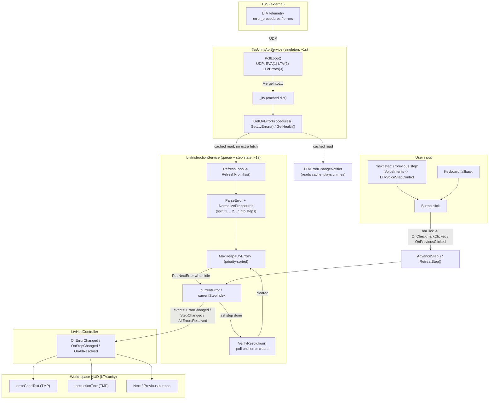

# LTV Instruction Pipeline — TSS → UI

How an LTV error in TSS telemetry becomes a step-by-step repair instruction on the
Magic Leap HUD, and how the user (button / voice) drives it forward.

## Components

| Stage | File | Role |
|-------|------|------|
| TSS source | *(external server)* | Holds LTV telemetry incl. `error_procedures` (LTV_ERRORS) |
| Transport / cache | `Assets/TSS-API/TssUnityApiService.cs` | UDP poller; caches latest telemetry; read-only accessors |
| Brain (queue + state) | `Assets/LTV/LtvInstructionService.cs` | Parses errors, priority-sorts them, tracks the running procedure, verifies resolution |
| Priority queue | `Assets/LTV/MaxHeap.cs` + `Assets/LTV/LtvError.cs` | Max-heap ordered by error priority |
| View | `Assets/LTV/LtvHudController.cs` | Subscribes to service events, writes the UI |
| UI widgets | `LTV.unity` (world-space Canvas) | Error-code text, instruction text, next/prev buttons |
| Input | `LtvHudController` buttons, `LTVVoiceStepControl` + `VoiceIntents` | Advance / retreat the current procedure |
| Side observer | `Assets/UI-Scripts/LTVErrorChangeNotifier.cs` | Audio chimes on new/resolved errors (read-only) |

## Architecture diagram



## Sequence — a new error appears and the user works it

```mermaid
sequenceDiagram
    participant TSS
    participant Poller as TssUnityApiService
    participant Svc as LtvInstructionService
    participant HUD as LtvHudController
    participant User

    TSS-->>Poller: UDP poll (~1s) → error_procedures
    Poller->>Poller: merge into _ltv cache
    Svc->>Poller: GetLtvErrorProcedures() (cached)
    Svc->>Svc: parse → LtvError, filter needs_resolved, Insert into MaxHeap
    alt no procedure currently running
        Svc->>Svc: PopNextError() → highest priority becomes currentError
        Svc-->>HUD: ErrorChanged + StepChanged(step 0)
        HUD->>HUD: errorCodeText = code; instructionText = step 0
    else a procedure is already running
        Note over Svc: new error waits in the queue, no preemption
    end
    User->>HUD: "next step" / click Next
    HUD->>Svc: AdvanceStep()
    Svc-->>HUD: StepChanged(step n)
    HUD->>HUD: instructionText = step n
    Note over Svc: after last step → VerifyResolution polls TSS
    TSS-->>Svc: error cleared
    Svc->>Svc: PopNextError() → next error or "all resolved"
```

## The pipeline in natural language

**1. TSS holds the truth.** An external TSS server publishes LTV telemetry, including a
list of `error_procedures` — each entry has a `code`, a `description`, a
`needs_resolved` flag, and an ordered list of `procedures` (the repair steps).

**2. The poller fetches and caches.** `TssUnityApiService` runs a `PollLoop`
coroutine roughly once per second. Each tick it sends three UDP requests (EVA, LTV,
LTV-errors) and merges whatever comes back into a single in-memory dictionary,
`_ltv`. Nothing else ever talks to the network — every other component reads this
cache through accessors like `GetLtvErrorProcedures()` and `GetHealth()`. The poller
is a `DontDestroyOnLoad` singleton, so it survives scene loads and is reachable via
`TssUnityApiService.Instance`.

**3. The service turns raw telemetry into a prioritized work queue.**
`LtvInstructionService` is the brain. Its own `RefreshLoop` (also ~1s) reads the
cached error list, and for every error that still needs resolving it builds an
`LtvError` object. During parsing it also normalizes procedures: a feed that ships a
whole procedure as one concatenated string (`"1. Do X 2. Do Y"`) is split into
individual steps so the HUD can show one at a time. Each new error is inserted into a
`MaxHeap` — a priority queue that sorts on insert. Priority is derived from the error
code itself: `criticality × 10 + subsystem` (the first two digits), with the ERM /
recovery-mode code `4800` pinned to maximum so it always runs first.

**4. One procedure runs at a time, and new errors never interrupt it.** The service
tracks `currentError` and `currentStepIndex`. It only pulls the next error off the
heap (`PopNextError`) when nothing is currently running — so if a higher-priority
error arrives mid-procedure, it simply waits in the queue at its sorted position; the
astronaut finishes what they're on. When the user completes the last step, the
service enters `VerifyResolution`, which keeps polling TSS until telemetry confirms
the error actually cleared, then advances to the next error (or reports that
everything is resolved, with a bounded retry if it didn't clear).

**5. The service announces state changes via events.** Rather than the UI polling the
service, the service fires C# events: `ErrorChanged` (a different error is now
active), `StepChanged` (the active step moved), and `AllErrorsResolved`. There's also
a richer `InstructionUpdated` snapshot used by debug tooling.

**6. The HUD controller renders those events.** `LtvHudController` subscribes to the
three events. `OnErrorChanged` writes the error code into `errorCodeText` and tints
the panel by danger level; `OnStepChanged` writes the current step text into
`instructionText` and enables/disables the next/previous buttons (previous is greyed
on step 0); `OnAllResolved` shows the "all resolved" message. The HUD lives on a
world-space Canvas that head-follows via `AdjustableFollowUI`.

**7. The user drives it back the other way.** Advancing or retreating a step is one
shared code path. A physical button click invokes `OnCheckmarkClicked` /
`OnPreviousClicked`; the voice phrases "next step" / "previous step" go through
`VoiceIntents` → `LTVVoiceStepControl`, which calls the button's `onClick.Invoke()`
(so voice and click hit the exact same handler); a keyboard fallback maps to the
checkmark. All of them ultimately call `AdvanceStep()` / `RetreatStep()` on the
service, which updates `currentStepIndex` and fires `StepChanged` again — closing the
loop back to step 6.

**8. A side observer adds audio feedback.** `LTVErrorChangeNotifier` watches the same
cached telemetry (read-only, no extra fetch) and plays a chime when the set of active
error codes gains a code (new error) or loses one (resolved). It does **not** touch
the queue — insertion and resolution are entirely the service's job; the notifier
only reacts.

## Data shape (reference)

```jsonc
// one entry of error_procedures
{
  "code": "4509",            // digit0 = criticality, digit1 = subsystem
  "description": "Nav system fault",
  "needs_resolved": true,    // false / absent ⇒ treated as resolved
  "procedures": ["Step 1 ...", "Step 2 ...", "Step 3 ..."]
}
```

- **Priority** = `4800` → max (ERM first); otherwise `criticality*10 + subsystem`.
- **Active set** = entries with `needs_resolved == true`.
- **Resolution** = a code leaving the active set (flag flips false or entry disappears).
```
